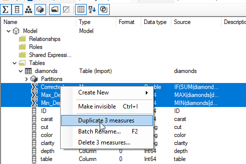
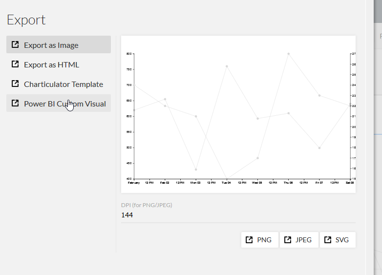
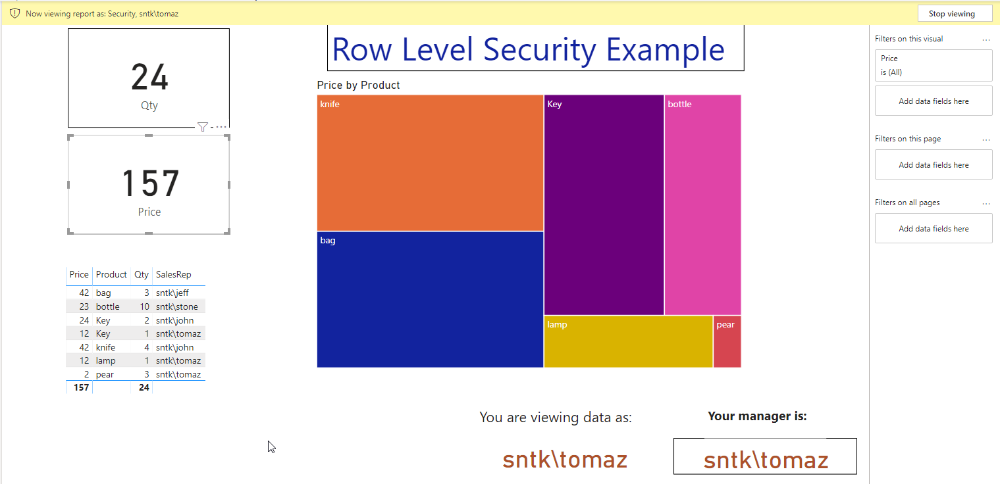

# DAX Functions and Power BI Samples

## DAX Functions

### Folder: 01_DAX_DimTime

```
DimTime =
     VAR V_Calendar = CALENDARAUTO()
RETURN
    GENERATE (
        V_Calendar;
        VAR V_Calendar_date = [Date]
        VAR LetoDatum = YEAR(V_Calendar_date)
        VAR Kvartal = CEILING(MONTH(V_Calendar_date)/3;1)
        VAR MesecCifra = MONTH(V_Calendar_date)
        VAR DanN = DAY(V_Calendar_date)
        VAR KonecMeseca = EOMONTH(V_Calendar_date; 0)
        VAR TedenCifra = WEEKNUM(V_Calendar_date; 2)
        VAR DanVTednu = WEEKDAY(V_Calendar_date;2)
        Return ROW(
            "Day"; V_Calendar_date;
            "OnlyDay"; DanN;
            "Year"; LetoDatum;
            "Month (number)"; MesecCifra;
            "Quarter"; Kvartal;
            "Month"; FORMAT(V_Calendar_date; "mmmm");
            "DayOfWeek"; DanVTednu;
            "NameOfWeek"; FORMAT(DanVTednu+1; "dddd");
            "Year Month"; FORMAT (V_Calendar_date; "mmm yy");
            "End Of Month"; FORMAT (KonecMeseca; "dd mmm yy");
            "Week Number"; TedenCifra
        )
    )

```

## Power BI Examples

### Folder: 02_Custom_FilterPane

DAX Examples for concatenating values of selected slicers:

```
Diamonds Clarity Selection = IF
(
ISFILTERED(diamonds[Clarity]);
SELECTEDVALUE(diamonds[clarity]; "Multiple colors selected");
"Filter not selected"
)
```

```
Diamonds Color Selections =
VAR Conc = CONCATENATEX(VALUES(diamonds[clarity]);
[Diamonds Clarity Selection];",")
RETURN(Conc)
```

### Folder: 03_Measures_Copy

Power BI on copying mesures between datasets in same Power BI document using Power BI Template and [Tabular Editor](https://github.com/otykier/TabularEditor/releases/tag/2.9.2).



Using Tabular Editor for copying measures


### Folder: 04_Custom_Visual

Power BI custom visual can be prepared and exported using   [Charts PowerBI.Tips](https://charts.powerbi.tips/).



Using Custom Power BI Visual


### Folder: 05_Row_Level_security

Power BI example on using Row-level security.



Sample view of RLS in Power BI


### Folder: 06_Measures_as_slicer

Power BI example on getting  measures as a slicer in Power BI.


View of slicer with measure names in Power BI


## Cloning the repository
You can follow the steps below to clone the repository. 
```
git clone -n https://github.com/tomaztk/DAX_Functions.git
```

## License
These samples and templates are all licensed under the MIT license.

## Questions
Email questions to: tomaztsql@gmail.com
